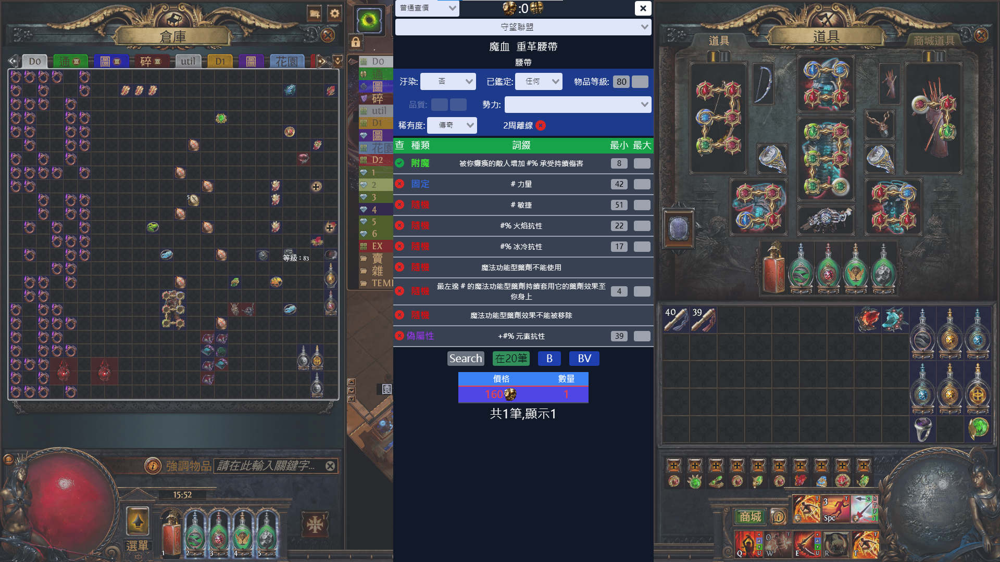
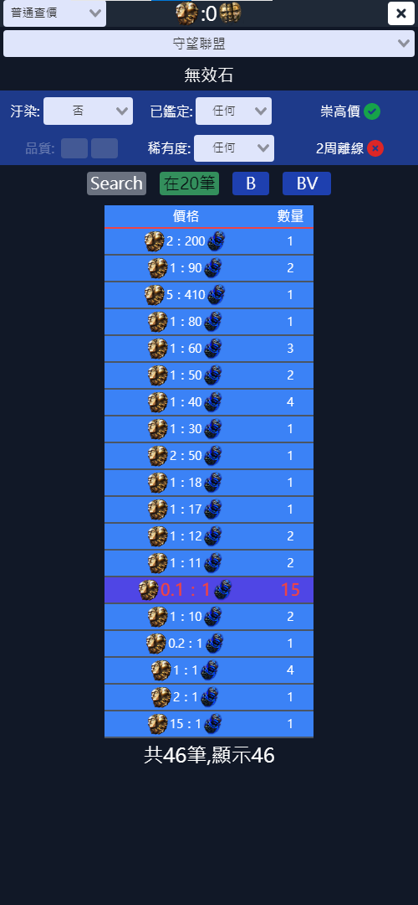
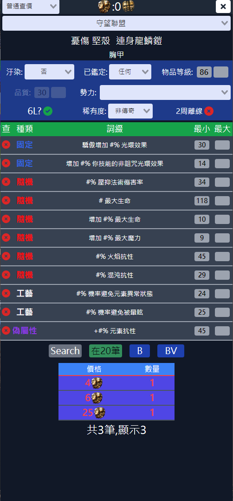
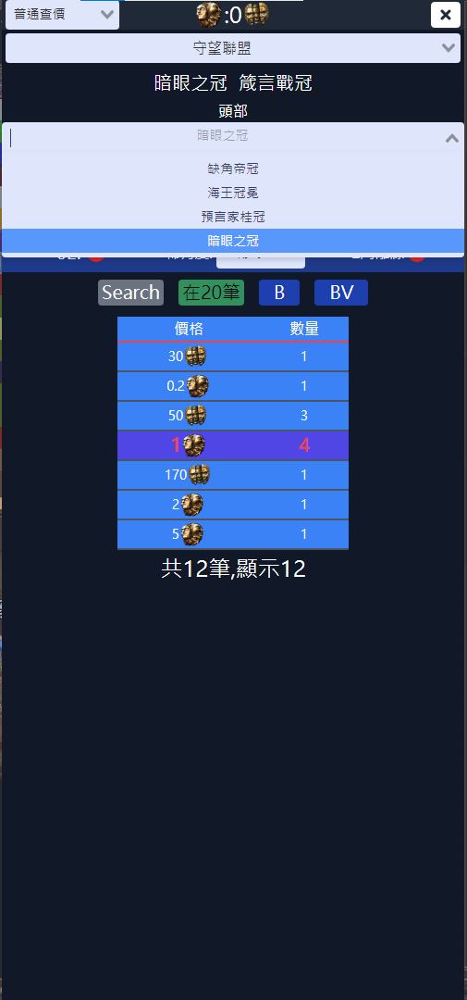

garena服POE查價工具  
# 預設快捷鍵  
Ctrl+F2 開啟設定與重設API資料按鈕  
Ctrl+D 查價  
F2 邀請最近密的人進組隊  
F3 %TY  
F4 退組隊，需在設定中設定角色名稱  
F5 回藏身處  

# 使用畫面
  

| 通貨 | 技能寶石 | 裝備 | 未鑑定傳奇 | 劫盜 |
|:----:|:-------:|:----:|:---------:|:----:|
||||||

# 使用過程影片

https://user-images.githubusercontent.com/24869073/179390492-42e02818-5bee-4d28-947f-53bcc3b8716f.mp4
